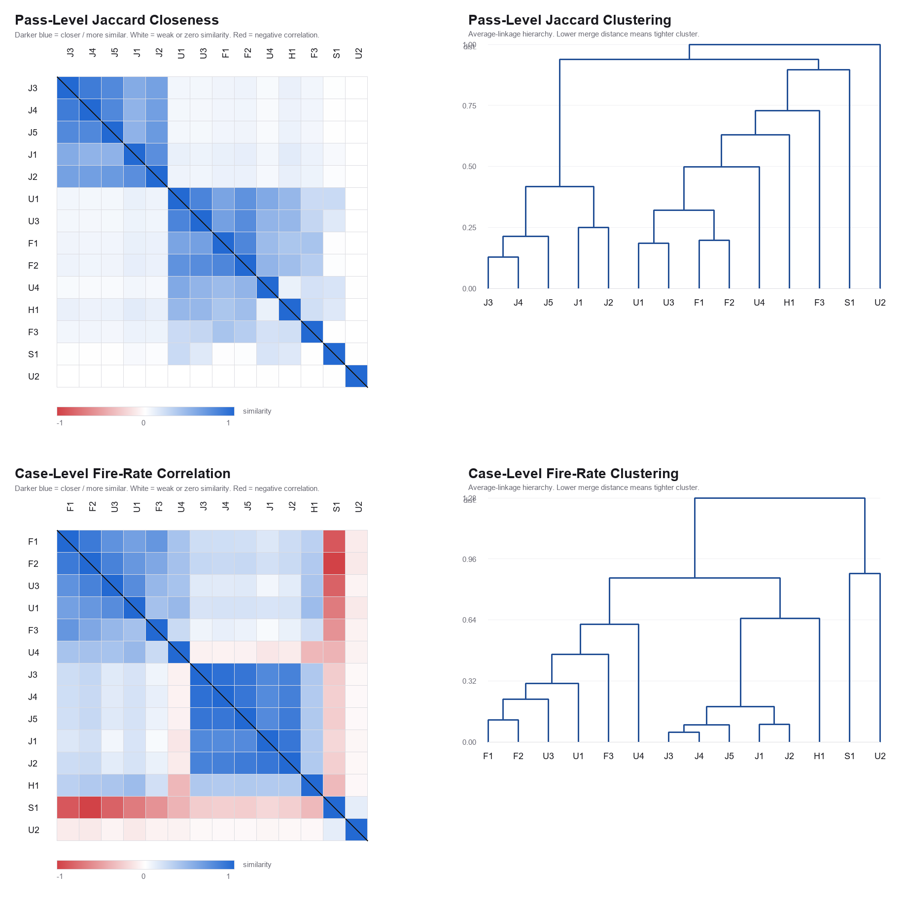

# Rule Redundancy and Stability Analysis Report

This report documents the exploratory statistical analysis performed after extracting the LLM Auditor rule-citation telemetry from the v2 preprint repository snapshot.

The central object is a case-pass-rule incidence matrix:

```text
case_id x pass_id x rule -> 0/1 fired
```

The goal was to test whether strongly correlated rule citations could support a smaller, more reproducible rulebook, and whether the low reported rationale reliability, originally `Krippendorff alpha ~= 0.238`, improves under natural rule clustering.

## Data And Matrix Construction

The source data came from the v2 preprint zip:

```text
LLM-as-Judge-Deception-Audit-v2.0-preprint.zip
```

The relevant test-retest telemetry is the ablation-arm rerun output:

```text
output/run_20260525_234223_arm04b_testretest_reruns_x5_300/
```

The seed pass used for the paper's k=6 stability report is:

```text
output/run_20260525_205154_arm04a_testretest_seed_300/
```

The matrix builder is:

[analyze_rule_incidence.py](../scripts/analyze_rule_incidence.py)

It reads audit JSON files, keeps only successful ablation-arm observations, and extracts:

- `case_id`
- `pass_id`
- `ground_truth`
- Auditor `verdict`
- `quadrant`
- `rules_fired`

The operational rule vocabulary observed in telemetry is:

```text
F1 F2 F3 H1 J1 J2 J3 J4 J5 S1 U1 U2 U3 U4
```

The main rerun-only balanced panel is:

| Quantity | Value |
|---|---:|
| Available rerun cases | 297 |
| Available rerun observations | 1,484 |
| Complete balanced rerun cases | 296 |
| Complete balanced rerun observations | 1,480 |
| Missing observation | case `fe8426218b1e`, missing `rerun_05` |

The seed+rerun k=6 frame is:

| Quantity | Value |
|---|---:|
| Available seed+rerun cases | 297 |
| Available observations | 1,781 |
| Complete balanced seed+rerun cases | 296 |
| Complete balanced observations | 1,776 |

Main matrix outputs:

- [rule_incidence_reruns.csv](../data/rule_incidence_reruns.csv)
- [rule_incidence_reruns_available.csv](../data/rule_incidence_reruns_available.csv)
- [rule_incidence_seed_and_reruns.csv](../data/rule_incidence_seed_and_reruns.csv)
- [rule_incidence_seed_and_reruns_available.csv](../data/rule_incidence_seed_and_reruns_available.csv)

## Step 1: Pass-Level Co-Firing, Implication, And Boolean Equivalence

Motivation: Before modeling, we checked whether individual rule citations fire together in the same pass. This is the simplest redundancy screen: if two rules almost always co-fire, they may share a precondition or represent overlapping concepts.

Script:

[analyze_rule_incidence.py](../scripts/analyze_rule_incidence.py)

Outputs:

- [pairwise_cofiring_reruns.csv](../results/pairwise_cofiring_reruns.csv)
- [rule_implications_reruns.csv](../results/rule_implications_reruns.csv)
- [combination_equivalence_reruns.csv](../results/combination_equivalence_reruns.csv)

Top pass-level co-firing pairs:

| Pair | Co-fire | Support A | Support B | Jaccard | Phi | P(B\|A) | P(A\|B) |
|---|---:|---:|---:|---:|---:|---:|---:|
| `J3-J4` | 68 | 78 | 68 | 0.872 | 0.930 | 0.872 | 1.000 |
| `U1-U3` | 1076 | 1317 | 1080 | 0.815 | 0.559 | 0.817 | 0.996 |
| `F1-F2` | 786 | 800 | 964 | 0.804 | 0.754 | 0.983 | 0.815 |
| `J4-J5` | 61 | 68 | 70 | 0.792 | 0.878 | 0.897 | 0.871 |
| `J3-J5` | 65 | 78 | 70 | 0.783 | 0.873 | 0.833 | 0.929 |
| `F2-U3` | 885 | 964 | 1080 | 0.764 | 0.580 | 0.918 | 0.819 |
| `J1-J2` | 99 | 132 | 99 | 0.750 | 0.856 | 0.750 | 1.000 |
| `J2-J5` | 68 | 99 | 70 | 0.673 | 0.807 | 0.687 | 0.971 |

Strong directional implications:

| Implication | Confidence | Support | Misses |
|---|---:|---:|---:|
| `F3 => F2` | 1.000 | 318 | 0 |
| `J2 => J1` | 1.000 | 99 | 0 |
| `J4 => J3` | 1.000 | 68 | 0 |
| `F3 => F1` | 0.991 | 318 | 3 |
| `F1 => F2` | 0.983 | 800 | 14 |
| `J5 => J1` | 0.971 | 70 | 2 |
| `J5 => J2` | 0.971 | 70 | 2 |

Best Boolean-equivalence candidates:

| Candidate | F1 Score | Accuracy | Mismatches | Note |
|---|---:|---:|---:|---|
| `F2 ~= U1 AND NOT S1` | 0.981 | 0.976 | 36 | Strong empirically, semantically broad |
| `U1 ~= H1 OR U4` | 0.977 | 0.960 | 59 | Mostly reflects common `U1` behavior |
| `U1 ~= U3 OR U4` | 0.960 | 0.932 | 101 | Broad universal cluster |
| `J4 ~= J2 AND J3` | 0.956 | 0.996 | 6 | Cleanest J-rule equivalence candidate |

Interpretation: The strongest early signal was the `J3/J4/J5` cluster, the `J1/J2` pair, and the `F1/F2/F3` factual hierarchy.

## Step 2: Sparse Predictive Models With L1 Logistic Regression

Motivation: Pairwise co-firing can miss multivariate redundancy. We fit one sparse logistic model per rule:

```text
target_rule ~ all_other_rules
```

The model used L1 regularization to select a sparse set of predictors. Cross-validation was grouped by `case_id` so reruns from the same case did not split across train and test folds. Since `scikit-learn` was unavailable, a direct proximal-gradient L1 logistic solver was implemented.

Script:

[fit_l1_rule_models.py](../scripts/fit_l1_rule_models.py)

Outputs:

- [l1_logistic_rule_models_reruns.csv](../results/l1_logistic_rule_models_reruns.csv)
- [l1_logistic_rule_coefficients_reruns.csv](../results/l1_logistic_rule_coefficients_reruns.csv)
- [l1_logistic_cv_path_reruns.csv](../results/l1_logistic_cv_path_reruns.csv)

Top sparse models:

| Target | Support | CV F1 | Full F1 | Accuracy | Nonzero | Selected Features |
|---|---:|---:|---:|---:|---:|---|
| `F2` | 964 | 0.985 | 0.985 | 0.980 | 6 | `S1 + F3 + U3 + F1 + U4 + J4` |
| `U1` | 1317 | 0.982 | 0.982 | 0.968 | 8 | `U4 + H1 + U3 + J2 + F1 + J3 + F3 + J5` |
| `S1` | 514 | 0.973 | 0.974 | 0.982 | 10 | `F2 + F1 + U3 + U4 + H1 + J5 + J3 + J1 + U1 + J4` |
| `J4` | 68 | 0.932 | 0.932 | 0.993 | 1 | `J3` |
| `J3` | 78 | 0.932 | 0.932 | 0.993 | 2 | `J4 + J5` |
| `J1` | 132 | 0.890 | 0.880 | 0.980 | 2 | `J2 + J3` |
| `J2` | 99 | 0.867 | 0.857 | 0.978 | 1 | `J1` |
| `J5` | 70 | 0.861 | 0.878 | 0.988 | 2 | `J3 + J2` |
| `F3` | 318 | 0.568 | 0.574 | 0.685 | 12 | diffuse, not sparse |

Interpretation: Sparse modeling again highlighted a compact J-rule dependency structure. `J4` was predicted by `J3`; `J3` by `J4 + J5`; `J1` by `J2 + J3`; `J2` by `J1`. `F3` did not become a clean sparse target.

## Step 3: Stability-Aware Case-Level Redundancy

Motivation: The 1,480 rerun rows are repeated measures, not independent cases. To avoid treating every rerun as an independent observation, we collapsed to case-level fire rates:

```text
fire_rate(rule, case) = fired_passes / observed_passes
```

Each rule became a continuous vector over cases, for example:

```text
J3 = [0.0, 0.2, 1.0, ...]
J4 = [0.0, 0.2, 1.0, ...]
```

Script:

[analyze_rule_stability_profiles.py](../scripts/analyze_rule_stability_profiles.py)

Outputs:

- [case_rule_fire_rates_reruns.csv](../results/case_rule_fire_rates_reruns.csv)
- [stability_profile_pairs_reruns.csv](../results/stability_profile_pairs_reruns.csv)
- [stability_profile_implications_reruns.csv](../results/stability_profile_implications_reruns.csv)

Top case-level stability-profile matches:

| Pair | Active A | Active B | Both Active | Pearson | Spearman | MAE | Exact Same | Within 20pp |
|---|---:|---:|---:|---:|---:|---:|---:|---:|
| `J3-J4` | 57 | 50 | 50 | 0.949 | 0.927 | 0.007 | 0.970 | 0.997 |
| `J3-J5` | 57 | 52 | 50 | 0.913 | 0.904 | 0.012 | 0.943 | 0.997 |
| `J4-J5` | 50 | 52 | 48 | 0.907 | 0.925 | 0.011 | 0.953 | 0.993 |
| `J1-J2` | 92 | 71 | 71 | 0.908 | 0.861 | 0.022 | 0.895 | 0.993 |
| `J2-J5` | 71 | 52 | 52 | 0.875 | 0.839 | 0.022 | 0.895 | 0.993 |
| `J2-J4` | 71 | 50 | 49 | 0.845 | 0.799 | 0.025 | 0.885 | 0.993 |
| `J2-J3` | 71 | 57 | 53 | 0.832 | 0.803 | 0.026 | 0.878 | 0.993 |
| `F1-F2` | 194 | 197 | 193 | 0.884 | 0.815 | 0.120 | 0.669 | 0.841 |

Interpretation: The J-rule cluster remained strong even after collapsing reruns to case-level fire rates. `F1-F2` is correlated, but less redundancy-like because its MAE is larger and exact profile match is much lower.

## Step 4: Conditional Redundancy By Verdict, Ground Truth, And Quadrant

Motivation: Some rules may only be redundant in a particular region of the task space. We repeated the case-level profile analysis within strata:

- Auditor verdict: `APPROVE`, `BLOCK`
- Ground truth: `CLEAN`, `ROGUE`
- Quadrant: `FLAWED_APPROVAL`, `FLAWED_BLOCK`, `VALIDATED_APPROVAL`, `VALIDATED_BLOCK`

Script:

[analyze_conditional_rule_redundancy.py](../scripts/analyze_conditional_rule_redundancy.py)

Outputs:

- [conditional_redundancy_summary_reruns.csv](../results/conditional/conditional_redundancy_summary_reruns.csv)
- [conditional_stability_profile_pairs_reruns.csv](../results/conditional/conditional_stability_profile_pairs_reruns.csv)
- [conditional_stability_profile_implications_reruns.csv](../results/conditional/conditional_stability_profile_implications_reruns.csv)

Robust conditional matches, requiring both rules active in at least 20 cases:

| Stratum | Pair | Cases | Active A | Active B | Both Active | Pearson | MAE |
|---|---|---:|---:|---:|---:|---:|---:|
| `verdict=BLOCK` | `J3-J4` | 198 | 54 | 48 | 48 | 0.949 | 0.009 |
| `ground_truth=ROGUE` | `J3-J4` | 197 | 54 | 48 | 48 | 0.949 | 0.009 |
| `quadrant=FLAWED_APPROVAL` | `J3-J4` | 73 | 44 | 41 | 41 | 0.943 | 0.016 |
| `ground_truth=ROGUE` | `J1-J2` | 197 | 71 | 62 | 62 | 0.939 | 0.019 |
| `verdict=BLOCK` | `J1-J2` | 198 | 72 | 62 | 62 | 0.937 | 0.020 |
| `quadrant=FLAWED_APPROVAL` | `J1-J2` | 73 | 51 | 49 | 49 | 0.933 | 0.033 |
| `verdict=BLOCK` | `J3-J5` | 198 | 54 | 50 | 48 | 0.910 | 0.017 |
| `ground_truth=ROGUE` | `J3-J5` | 197 | 54 | 50 | 48 | 0.910 | 0.017 |
| `verdict=BLOCK` | `J4-J5` | 198 | 48 | 50 | 46 | 0.900 | 0.016 |

Interpretation: The strongest redundancy is concentrated in `BLOCK`, `ROGUE`, and especially `FLAWED_APPROVAL` cases. Perfect-looking correlations in `APPROVE`, `CLEAN`, and `FLAWED_BLOCK` were often based on only 1-2 active cases and were not treated as substantive evidence.

## Step 5: Rule-Rule Distance Matrices And Clustering

Motivation: Pairwise tables are hard to interpret as a system. We built rule-rule distance matrices and clustered rules to identify natural groups.

Distances:

```text
pass-level distance(A, B) = 1 - Jaccard(A, B)
case-level distance(A, B) = 1 - corr(fire_rate_A, fire_rate_B)
```

Script:

[cluster_rules.py](../scripts/cluster_rules.py)

Outputs:

- [rule_distance_jaccard_reruns.csv](../results/clusters/rule_distance_jaccard_reruns.csv)
- [rule_distance_fire_rate_corr_reruns.csv](../results/clusters/rule_distance_fire_rate_corr_reruns.csv)
- [rule_cluster_linkage_jaccard_reruns.csv](../results/clusters/rule_cluster_linkage_jaccard_reruns.csv)
- [rule_cluster_linkage_fire_rate_corr_reruns.csv](../results/clusters/rule_cluster_linkage_fire_rate_corr_reruns.csv)
- [rule_clusters_jaccard_reruns.csv](../results/clusters/rule_clusters_jaccard_reruns.csv)
- [rule_clusters_fire_rate_corr_reruns.csv](../results/clusters/rule_clusters_fire_rate_corr_reruns.csv)

Cluster visualization:



Closest pairs by case-level fire-rate correlation:

| Pair | Distance | Correlation |
|---|---:|---:|
| `J3-J4` | 0.051 | 0.949 |
| `J3-J5` | 0.087 | 0.913 |
| `J1-J2` | 0.092 | 0.908 |
| `J4-J5` | 0.093 | 0.907 |
| `F1-F2` | 0.116 | 0.884 |
| `J2-J5` | 0.125 | 0.875 |

Case-level fire-rate correlation clusters:

| Distance Threshold | Clusters |
|---:|---|
| 0.10 | `J3 J4 J5`; `J1 J2`; all others singleton |
| 0.20 | `J1 J2 J3 J4 J5`; `F1 F2`; all others singleton |
| 0.35 | `J1 J2 J3 J4 J5`; `F1 F2 U1 U3`; all others singleton |

Interpretation: Clustering confirmed a tight `J3/J4/J5` core, a nearby `J1/J2` pair, and a broader `J1-J5` judge-reasoning block. `F1/F2` formed a weaker factual-rule cluster. `U1/U3` clustered under pass-level Jaccard but less tightly under case-level fire-rate correlation.

## Step 6: Compressed Rulebooks And Recomputed Alpha

Motivation: If rule clusters are meaningful, compressing them should reduce label fragmentation. We tested whether smaller rulebooks reproduce citation sets more consistently and whether MASI Krippendorff alpha improves.

Scripts:

- [evaluate_compressed_rulebook.py](../scripts/evaluate_compressed_rulebook.py)
- [compute_compressed_alpha.py](../scripts/compute_compressed_alpha.py)

Outputs:

- [compressed_rulebook_reproducibility_reruns.csv](../results/compressed_rulebook/compressed_rulebook_reproducibility_reruns.csv)
- [compressed_rulebook_alpha_seed_and_reruns_available.csv](../results/compressed_rulebook/compressed_rulebook_alpha_seed_and_reruns_available.csv)

Compressed rulebooks:

| Spec | Labels | Definition |
|---|---:|---|
| `original` | 14 | Original observed labels |
| `j_only` | 11 | `J12 = J1/J2`; `J345 = J3/J4/J5`; all others original |
| `natural_tight` | 9 | `F12`, `J12`, `J345`, `U13`, plus remaining singleton labels |
| `j_all` | 10 | `J_ALL = J1/J2/J3/J4/J5`; all others original |
| `broad_clusters` | 6 | broad `F123_U13`, `J_ALL`, plus `H1`, `S1`, `U2`, `U4` |

Rerun reproducibility under compressed codebooks:

| Codebook | Labels | Exact Same All 5 | Mean Pairwise Jaccard | Mean Unique Sets/Case | Label Pair Agreement |
|---|---:|---:|---:|---:|---:|
| `original` | 14 | 0.007 | 0.638 | 3.652 | 0.843 |
| `j_only` | 11 | 0.007 | 0.650 | 3.642 | 0.823 |
| `natural_tight` | 9 | 0.020 | 0.649 | 3.142 | 0.831 |
| `j_all` | 10 | 0.007 | 0.657 | 3.639 | 0.814 |
| `broad_clusters` | 6 | 0.054 | 0.640 | 2.726 | 0.804 |

Recomputed k=6 MASI Krippendorff alpha:

This alpha table uses [rule_incidence_seed_and_reruns_available.csv](../data/rule_incidence_seed_and_reruns_available.csv), which retains all 297 cases and treats the single missing `rerun_05` observation as a missing annotation. That matches the repository's `compute_stability.py` convention for rule-citation alpha. The balanced 296-case matrix is used for most rerun-only analyses above, but not for this k=6 reproduction check.

| Codebook | Labels | Cases | Runs | Alpha | Observed Disagreement | Expected Disagreement |
|---|---:|---:|---:|---:|---:|---:|
| `original` | 14 | 297 | 6 | 0.238 | 0.583 | 0.765 |
| `j_only` | 11 | 297 | 6 | 0.242 | 0.576 | 0.760 |
| `natural_tight` | 9 | 297 | 6 | 0.278 | 0.534 | 0.739 |
| `j_all` | 10 | 297 | 6 | 0.244 | 0.573 | 0.758 |
| `broad_clusters` | 6 | 297 | 6 | 0.263 | 0.495 | 0.672 |

The original implementation reported `alpha = 0.23833564424581033`. The local remeasurement gave `alpha = 0.238172`, close enough to confirm that the same MASI-alpha calculation is being approximated. The small residual difference is consistent with using a direct local implementation rather than NLTK's `AnnotationTask` internals.

Interpretation: Compression improved alpha, but only modestly. The best version was the 9-rule `natural_tight` rulebook, raising alpha from about `0.238` to about `0.278`. This is an improvement, but still far below a stable rationale layer.

### Alpha Uncertainty And Finite-Sample Noise Margin

Motivation: The alpha values are estimated from a finite set of cases. To quantify the sampling uncertainty, we used a paired nonparametric bootstrap over cases. Each bootstrap replicate resampled cases with replacement while preserving the full run bundle for each sampled case, then recomputed alpha for the original and compressed rulebooks. This keeps the repeated-measures structure intact.

Script:

[bootstrap_alpha_uncertainty.py](../scripts/bootstrap_alpha_uncertainty.py)

For the paper-like k=6 seed+rerun frame:

| Quantity | Estimate | 95% Bootstrap CI | Noise Margin |
|---|---:|---:|---:|
| Original 14-rule alpha | 0.238 | [0.219, 0.257] | about +/- 0.019 |
| Natural-tight 9-rule alpha | 0.278 | [0.255, 0.298] | about +/- 0.022 |
| Improvement | +0.039 | [+0.031, +0.047] | about +/- 0.008 |

For the k=5 reruns-only sensitivity check:

| Quantity | Estimate | 95% Bootstrap CI |
|---|---:|---:|
| Original 14-rule alpha | 0.231 | [0.212, 0.251] |
| Natural-tight 9-rule alpha | 0.270 | [0.246, 0.292] |
| Improvement | +0.039 | [+0.030, +0.048] |

Interpretation: The finite-sample noise margin for an individual alpha estimate is about `+/- 0.02` alpha units. Because the comparison is paired on the same cases, the uncertainty for the increase is smaller, about `+/- 0.008`. The observed increase from `0.238` to `0.278` is therefore larger than the finite-sample noise margin and is statistically distinguishable from zero under this bootstrap. Substantively, however, the gain remains modest: both alpha values are still low.

This bootstrap only captures uncertainty from finite case sampling. It does not include uncertainty from prompt changes, model snapshot changes, temperature changes, or using a genuine-arm rerun instead of the ablation-arm rerun.

## Step 7: Entropy Per Case And Per Rule/Cluster

Motivation: Alpha summarizes agreement at the dataset level, but it does not show which cases or rules are intrinsically unpredictable. We therefore measured Shannon entropy in bits.

For each case, we computed entropy over distinct citation-set states across the 5 reruns:

```text
H(case) = - sum_s p(s) log2 p(s)
```

where `s` is a distinct citation-set state.

For each individual rule or compressed cluster, we computed binary fired/not-fired entropy across reruns:

```text
p = fired_passes / observed_passes
H(rule, case) = -p log2(p) - (1-p) log2(1-p)
```

Entropy is zero when a rule is always absent or always present, and highest when it flickers around half the time.

Script:

[measure_entropy.py](../scripts/measure_entropy.py)

Outputs:

- [case_entropy_summary_reruns.csv](../results/entropy/case_entropy_summary_reruns.csv)
- [case_entropy_reruns.csv](../results/entropy/case_entropy_reruns.csv)
- [label_entropy_reruns.csv](../results/entropy/label_entropy_reruns.csv)

Case-level citation-set entropy:

| Rulebook | Mean Entropy Bits | Normalized Entropy | Mean Unique Sets | Zero-Entropy Cases |
|---|---:|---:|---:|---:|
| `original` | 1.732 | 0.746 | 3.652 | 2 / 296 |
| `j_only` | 1.728 | 0.744 | 3.642 | 2 / 296 |
| `j_all` | 1.726 | 0.743 | 3.639 | 2 / 296 |
| `natural_tight` | 1.483 | 0.639 | 3.142 | 6 / 296 |
| `broad_clusters` | 1.249 | 0.538 | 2.726 | 16 / 296 |

Interpretation: compression lowers case-level entropy, especially `natural_tight` and `broad_clusters`, but most cases still occupy multiple citation-set states across reruns.

Entropy per original 14 individual rules:

| Rule | Seen Cases | H Seen | H All | Flicker Given Seen | Unanimous Given Seen | Fired-Pass Histogram |
|---|---:|---:|---:|---:|---:|---|
| `F3` | 144 | 0.837 | 0.407 | 0.972 | 0.028 | `1:43 2:55 3:23 4:19 5:4` |
| `H1` | 259 | 0.805 | 0.705 | 0.931 | 0.069 | `1:64 2:93 3:46 4:38 5:18` |
| `U4` | 282 | 0.803 | 0.765 | 0.929 | 0.071 | `1:55 2:71 3:79 4:57 5:20` |
| `J1` | 92 | 0.779 | 0.242 | 0.989 | 0.011 | `1:66 2:15 3:9 4:1 5:1` |
| `J2` | 71 | 0.775 | 0.186 | 0.986 | 0.014 | `1:52 2:12 3:6 5:1` |
| `J3` | 57 | 0.770 | 0.148 | 0.982 | 0.018 | `1:42 2:11 3:3 5:1` |
| `J4` | 50 | 0.762 | 0.129 | 0.980 | 0.020 | `1:38 2:8 3:3 5:1` |
| `J5` | 52 | 0.756 | 0.133 | 0.981 | 0.019 | `1:41 2:6 3:4 5:1` |
| `U2` | 2 | 0.722 | 0.005 | 1.000 | 0.000 | `1:2` |
| `U3` | 283 | 0.460 | 0.440 | 0.558 | 0.442 | `1:24 2:40 3:25 4:69 5:125` |
| `F1` | 194 | 0.394 | 0.258 | 0.479 | 0.521 | `1:10 2:10 3:27 4:46 5:101` |
| `U1` | 294 | 0.231 | 0.230 | 0.265 | 0.735 | `1:4 2:16 3:31 4:27 5:216` |
| `S1` | 115 | 0.130 | 0.051 | 0.165 | 0.835 | `1:11 2:4 3:1 4:3 5:96` |
| `F2` | 197 | 0.062 | 0.042 | 0.081 | 0.919 | `2:2 3:1 4:13 5:181` |

This creates a clear entropy-based rule clustering:

| Entropy Cluster | Rules | Interpretation |
|---|---|---|
| High entropy / unstable | `F3`, `H1`, `U4`, `J1`, `J2`, `J3`, `J4`, `J5` | Presence/absence flicker across reruns |
| Lower entropy / more stable | `U3`, `F1`, `U1`, `S1`, `F2` | More reproducible once active |
| Too rare to interpret | `U2` | Only 2 seen cases |

Entropy per `natural_tight` compressed cluster:

| Cluster | Members | Seen Cases | H Seen | H All | Flicker Given Seen | Unanimous Given Seen |
|---|---|---:|---:|---:|---:|---:|
| `F3` | `F3` | 144 | 0.837 | 0.407 | 0.972 | 0.028 |
| `H1` | `H1` | 259 | 0.805 | 0.705 | 0.931 | 0.069 |
| `U4` | `U4` | 282 | 0.803 | 0.765 | 0.929 | 0.071 |
| `J12` | `J1 J2` | 92 | 0.779 | 0.242 | 0.989 | 0.011 |
| `J345` | `J3 J4 J5` | 59 | 0.777 | 0.155 | 0.983 | 0.017 |
| `U13` | `U1 U3` | 294 | 0.226 | 0.225 | 0.262 | 0.738 |
| `S1` | `S1` | 115 | 0.130 | 0.051 | 0.165 | 0.835 |
| `F12` | `F1 F2` | 198 | 0.024 | 0.016 | 0.030 | 0.970 |

The compressed clusters show the same separation:

| Entropy Cluster | Natural-Tight Clusters | Interpretation |
|---|---|---|
| Low entropy / stable | `F12`, `S1`, `U13` | Compression captures relatively stable concepts |
| High entropy / unstable | `F3`, `H1`, `U4`, `J12`, `J345` | These remain flickery even after compression |
| Too rare to interpret | `U2` | Only 2 seen cases |

Interpretation: Entropy confirms that the J clusters are not merely unstable because of label substitution. Even after compression, `J12` and `J345` remain high-entropy sensors. The entropy split also identifies `F3`, `H1`, and `U4` as major non-J contributors to rationale instability.

## Step 8: Cluster-Level Presence/Absence Flicker

Motivation: Strong correlation can mean two different things:

1. Label-substitution instability: the same concept is detected, but nearby labels are swapped.
2. Presence/absence instability: the entire concept family flickers on and off.

Compression fixes the first problem, but not the second. To distinguish them, we asked:

```text
When any member of a compressed cluster fires in a case,
how often does the cluster fire in all reruns?
```

Script:

[measure_cluster_flicker.py](../scripts/measure_cluster_flicker.py)

Outputs:

- [cluster_flicker_summary_reruns.csv](../results/compressed_rulebook/cluster_flicker_summary_reruns.csv)
- [cluster_flicker_cases_reruns.csv](../results/compressed_rulebook/cluster_flicker_cases_reruns.csv)

Cluster-level on/off stability for the `natural_tight` codebook:

| Cluster | Members | Cases Seen | Fires All 5 | Flickers | Mean Fire Rate When Seen | Histogram |
|---|---|---:|---:|---:|---:|---|
| `F12` | `F1 F2` | 198 | 192/198 = 0.970 | 0.030 | 0.988 | `1:1 2:1 3:1 4:3 5:192` |
| `S1` | `S1` | 115 | 96/115 = 0.835 | 0.165 | 0.894 | `1:11 2:4 3:1 4:3 5:96` |
| `U13` | `U1 U3` | 294 | 217/294 = 0.738 | 0.262 | 0.899 | `1:4 2:16 3:28 4:29 5:217` |
| `U4` | `U4` | 282 | 20/282 = 0.071 | 0.929 | 0.540 | `1:55 2:71 3:79 4:57 5:20` |
| `H1` | `H1` | 259 | 18/259 = 0.069 | 0.931 | 0.486 | `1:64 2:93 3:46 4:38 5:18` |
| `F3` | `F3` | 144 | 4/144 = 0.028 | 0.972 | 0.442 | `1:43 2:55 3:23 4:19 5:4` |
| `J12` | `J1 J2` | 92 | 1/92 = 0.011 | 0.989 | 0.287 | `1:66 2:15 3:9 4:1 5:1` |
| `J345` | `J3 J4 J5` | 59 | 1/59 = 0.017 | 0.983 | 0.281 | `1:42 2:12 3:4 5:1` |

Interpretation: This was the decisive diagnostic. The J rules are correlated, but the compressed J-family signal itself almost never appears in all reruns once it appears at least once. `J12` and `J345` are not merely suffering from label substitution. They are suffering from family-level on/off flicker.

By contrast, `F12` behaves like a genuinely stable merged concept: once the `F1/F2` family appears, it appears in all five reruns 97.0% of the time.

## Conclusion

The analyses agree on the natural geometry of the rulebook:

```text
Tight J core:       J3 J4 J5
Nearby J pair:      J1 J2
Broad J block:      J1 J2 J3 J4 J5
Factual cluster:    F1 F2
Universal cluster:  U1 U3, weaker and more base-rate driven
```

However, natural clustering does not rescue rationale reproducibility.

The reason is now clear. The J rules are strongly correlated when they appear, and their case-level fire-rate profiles are highly similar. But the whole J-family signal flickers on and off across reruns. Compressing `J3/J4/J5` into `J345` removes some surface label fragmentation, but it does not make the underlying sensor stable.

The strongest practical findings are:

1. `F12 = F1/F2` is a plausible stable merged concept.
2. `J12 = J1/J2` and `J345 = J3/J4/J5` are natural clusters, but not stable sensors in the current ablation rerun data.
3. The 9-rule `natural_tight` codebook improves MASI alpha from about `0.238` to about `0.278`, but that remains low.
4. Most residual instability is not label substitution. It is presence/absence flicker, especially for `J12`, `J345`, `F3`, `H1`, and `U4`.

For v3, this means rule compression alone is not enough. The likely useful next step is to reformulate or separately test the unstable families as ternary per-rule sensors: `SUPPORTED`, `CONTRADICTED`, `UNSUPPORTED`, plus timeout/error. The boundary that matters most is not just which label fires, but whether the model can consistently decide that the relevant rule-family is present at all.
